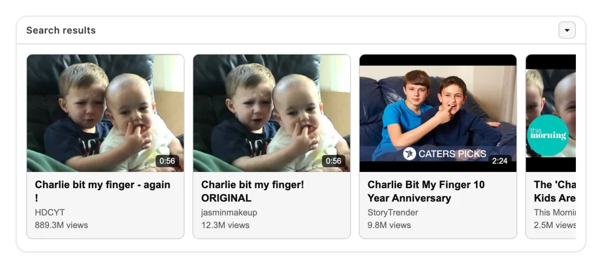
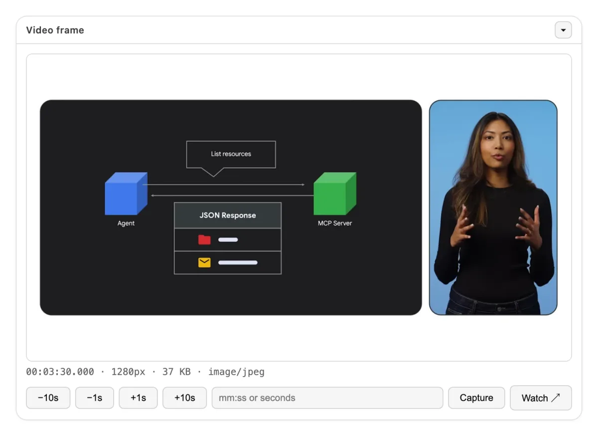
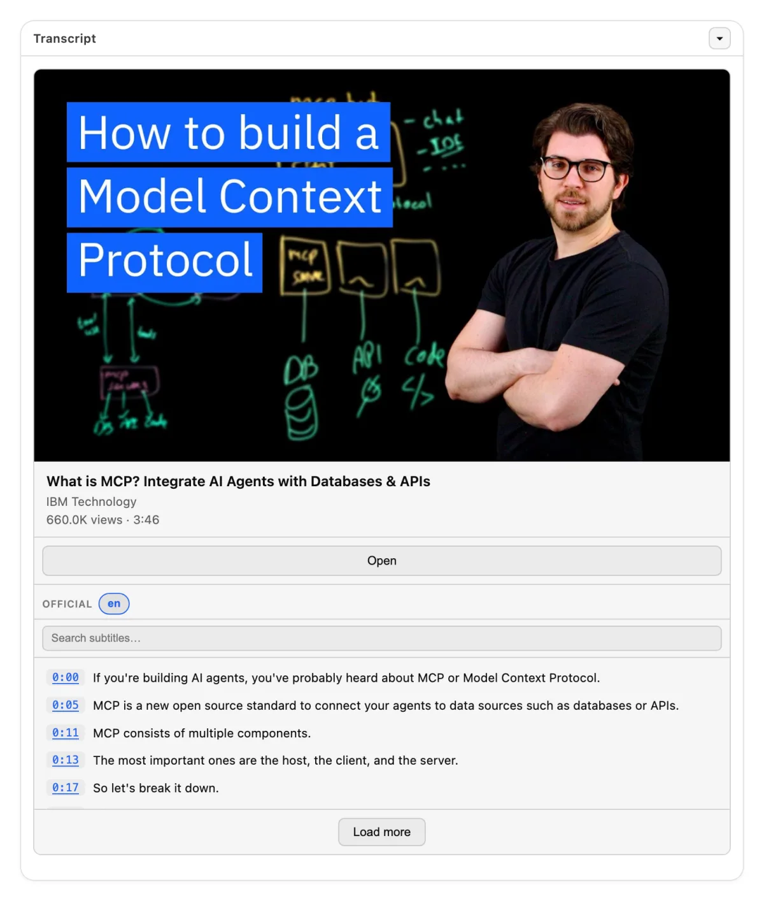
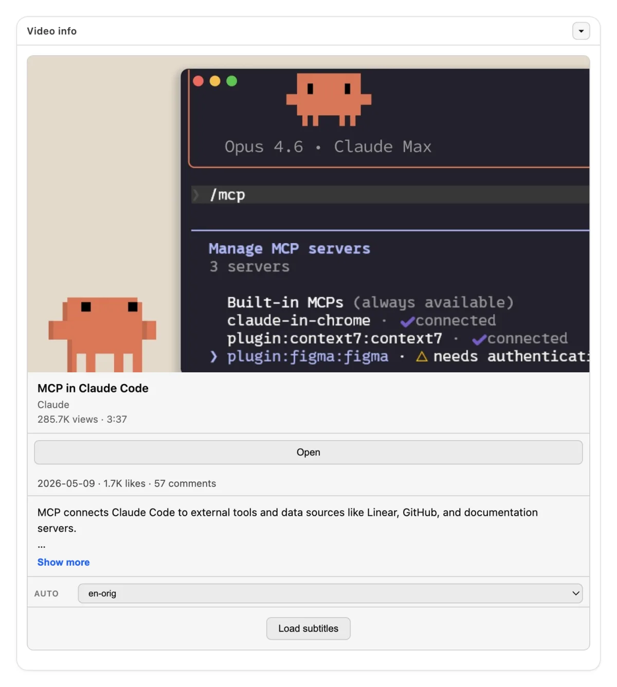

<div align="center">


# 🎬 Now your AI assistant can watch videos!

**Connect one server. Then ask Claude, ChatGPT or etc about a video:** the transcript, the chapters, the metadata, or a single frame. It works with 11 platforms, not only YouTube.

[](https://registry.modelcontextprotocol.io/v0/servers?search=transcriptor)
[](https://hub.docker.com/r/artsamsonov/transcriptor-mcp)
[](#-widgets)
[](LICENSE)

**[Connect](#-connect-in-30-seconds) · [What to ask](#-what-you-can-ask) · [Widgets](#-widgets) · [Platforms](#-platforms) · [Self-host](#-self-host)**

</div>

---

## ⚡ Connect in 30 seconds

The hosted endpoint is:

```text
https://gateway.mcpal.io/mcp/transcriptor
```

### 🖱️ One click

[](https://cursor.com/en/install-mcp?name=transcriptor&config=eyJ1cmwiOiJodHRwczovL2dhdGV3YXkubWNwYWwuaW8vbWNwL3RyYW5zY3JpcHRvciJ9)
[](https://insiders.vscode.dev/redirect/mcp/install?name=transcriptor&config=%7B%22type%22%3A%22http%22%2C%22url%22%3A%22https%3A%2F%2Fgateway.mcpal.io%2Fmcp%2Ftranscriptor%22%7D)

### ⌨️ One command, for Claude Code

```bash
claude mcp add --transport http transcriptor https://gateway.mcpal.io/mcp/transcriptor
```

Then run `/mcp` and approve the sign-in in the browser. After this, `claude mcp list` shows `✔ Connected`.

### 🧭 No terminal

| Client | What to do |
| --- | --- |
| **Claude** (web and desktop) | Open [Settings → Connectors](https://claude.ai/settings/connectors). Select **Add custom connector**, paste `https://gateway.mcpal.io/mcp/transcriptor`, then select **Add**. |
| **ChatGPT** | Open Settings → **Security and login** and turn on **Developer mode**. Then open Plugins, select **+**, and paste `https://gateway.mcpal.io/mcp/transcriptor`. |

> **Note:** ChatGPT developer mode is available on the web, for paid plans. Some releases show this control as Settings → Apps & Connectors → Advanced.

### 🧩 Any other MCP client

If your client is not in the list above, add the server with this configuration:

```json
{
  "mcpServers": {
    "transcriptor": {
      "url": "https://gateway.mcpal.io/mcp/transcriptor"
    }
  }
}
```

If you want to run the server yourself, read [Self-host](#-self-host). The tools are the same and you need no account.

---

## 🧰 What you can ask

| Ask for this | Tool |
| --- | --- |
| *"Summarize this video for me"* | `get_transcript` |
| *"Give me the subtitles as an SRT file"* | `get_raw_subtitles` |
| *"Is there a German track for this video?"* | `get_available_subtitles` |
| *"Who published this and how many views?"* | `get_video_info` |
| *"Go to the part about pricing"* | `get_video_chapters` |
| *"Show me the screen at 4:12"* | `get_video_frame` |
| *"Get transcripts for the first 5 videos in this playlist"* | `get_playlist_transcripts` |
| *"Find recent videos about X"* | `search_videos` (YouTube) |

Long transcripts come in parts. Each response gives a cursor for the next part, so no text is lost.

<details>
<summary><b>Full tool reference</b> (input and structured response)</summary>

Each tool that takes a video accepts `url`. This is a link from a [supported platform](#-platforms) or a plain YouTube ID. Each tool returns `content` (text for the chat) and `structuredContent` (typed JSON for your code).

#### `get_transcript`

Clean plain text, without timestamps, HTML, or speaker names. The tool finds the type and the language for you.

Response: `videoId`, `type`, `lang`, `text`, `is_truncated`, `total_length`, `start_offset`, `end_offset`. When more text is available, the response also has `next_cursor`.

#### `get_raw_subtitles`

Raw SRT or VTT content, in parts.

Input:

- `type` — `official` or `auto`
- `lang` — a language code
- `response_limit` — default `50000`, minimum `1000`, maximum `200000`
- `next_cursor` — the cursor of the previous response

Response: the fields of `get_transcript`, plus `format` (`srt` or `vtt`) and `content`.

#### `get_available_subtitles`

Response: `official` and `auto`. Each field is a sorted list of language codes. Use this tool first, then give `type` and `lang` to the tools above.

#### `get_video_info`

Extended metadata from yt-dlp:

- identity — `videoId`, `title`, `description`, `webpageUrl`
- author — `uploader`, `uploaderId`, `channel`, `channelId`, `channelUrl`
- numbers — `duration`, `uploadDate`, `viewCount`, `likeCount`, `commentCount`
- classification — `tags`, `categories`, `liveStatus`, `isLive`, `wasLive`, `availability`
- images — `thumbnail` and `thumbnails`

#### `get_video_chapters`

Response: `chapters`. Each item has `startTime`, `endTime`, and `title`. When the video has no chapters, the list is empty.

#### `get_video_frame`

Input:

- `timecode` — `"MM:SS"` or `"HH:MM:SS.mmm"`
- `seconds` — an alternative to `timecode`. Give one of the two, not both
- `format` — `jpeg` (default) or `png`
- `width` — default `1280`, maximum `1920`, never larger than the source
- `quality` — `2` to `31`, for jpeg only

Response: an image block, plus `timestampSeconds`, `timestamp`, `mimeType`, `sizeBytes`, and `width`. This tool needs `ffmpeg`. The Docker image includes it.

#### `get_playlist_transcripts`

Input:

- `url` — a playlist URL, or a watch URL with `list=`
- `type`, `lang`, `format` — the same as `get_raw_subtitles`
- `playlistItems` — a yt-dlp `-I` value such as `1:5`, `1,3,7`, or `-1`
- `maxItems` — the maximum number of videos

Response: `results`. Each item has `videoId` and `text`.

#### `search_videos`

Input:

- `query` — the search text
- `limit` — default 10, maximum 50
- `offset` — the number of results to skip
- `uploadDateFilter` — `hour`, `today`, `week`, `month`, or `year`
- `response_format` — `json` (default) or `markdown`

Response: `results`. Each item has `videoId`, `title`, `url`, `duration`, `uploader`, `viewCount`, and `thumbnail`.

</details>

---

## 📺 Widgets

Four tools have an interactive interface: `get_transcript`, `get_video_info`, `get_video_frame`, and `search_videos`. Clients that support [MCP Apps](https://github.com/modelcontextprotocol/ext-apps) and the ChatGPT Apps SDK show this interface in the chat. Other clients get the same data as text and JSON.

<table>
  <tr>
    <td width="50%" valign="top">
      
      <p align="center"><sub><code>search_videos</code> · <i>"charlie bit my finger"</i></sub></p>
    </td>
    <td width="50%" valign="top">
      
      <p align="center"><sub><code>get_video_frame</code> · <i>Double Rainbow</i> at 0:34</sub></p>
    </td>
  </tr>
  <tr>
    <td width="50%" valign="top">
      
      <p align="center"><sub><code>get_transcript</code> · <i>Me at the zoo</i>, the first video on YouTube</sub></p>
    </td>
    <td width="50%" valign="top">
      
      <p align="center"><sub><code>get_video_info</code> · <i>Gangnam Style</i>, 6.0B views</sub></p>
    </td>
  </tr>
</table>

---

## 🌍 Platforms

**YouTube · Twitter/X · Instagram · TikTok · Twitch · Vimeo · Facebook · Bilibili · VK · Dailymotion · Reddit**

Each tool that takes a video accepts a link from these 11 platforms. The tool `search_videos` works with YouTube only, through yt-dlp `ytsearch`.

The server does not download video or audio files for you. It returns text, metadata, and single frames.

---

## 🐳 Self-host

The tools are the same as on the hosted endpoint. You need no account.

Run the server with Docker. The image serves Streamable HTTP on port 4200:

```bash
docker run --rm -p 4200:4200 artsamsonov/transcriptor-mcp:latest
```

Then point your client at `http://localhost:4200/mcp`.

For stdio, give the image an explicit command:

```bash
docker run --rm -i artsamsonov/transcriptor-mcp:latest npm run start:mcp
```

```json
{
  "mcpServers": {
    "transcriptor": {
      "command": "docker",
      "args": ["run", "--rm", "-i", "artsamsonov/transcriptor-mcp:latest", "npm", "run", "start:mcp"]
    }
  }
}
```

The server starts with no environment variables. Each variable below is optional.

| Variable | Default | Function |
| --- | --- | --- |
| `MCP_PORT` and `MCP_HOST` | `4200` and `0.0.0.0` | The HTTP listener |
| `COOKIES_FILE_PATH` | — | A Netscape cookies file for videos that need an account. See [cookies.example.txt](cookies.example.txt) |
| `WHISPER_MODE` | `off` | Set `local` or `api` to transcribe the audio when a video has no subtitles. Then set `WHISPER_BASE_URL` or `WHISPER_API_KEY` |
| `CACHE_MODE` | `off` | Set `redis` and `CACHE_REDIS_URL` to cache subtitles and metadata |
| `YT_DLP_*` | — | Timeouts, proxy, and JS runtimes. See [.env.example](.env.example) |

The same port serves `GET /health` and `GET /metrics`. The metrics are in Prometheus format and include the `mcp_*` counters.

<details>
<summary><b>Transport, REST API, and development</b></summary>

**Transport.** The server accepts `POST /mcp` only. `GET` and `DELETE` return `405`. The server is stateless and sends no `Mcp-Session-Id`.

The Node process does not check bearer tokens. Put a reverse proxy or a gateway in front of it for authentication and TLS. The hosted endpoint works this way.

**REST API.** A second image gives the same extraction over plain HTTP:

```bash
docker run --rm -p 3000:3000 artsamsonov/transcriptor-mcp-api:latest
```

The Swagger interface is at `http://localhost:3000/docs`. For a full stack with the API and the MCP server, read [docker-compose.example.yml](docker-compose.example.yml).

**Development.**

```bash
npm ci
npm run build
npm run dev:mcp        # stdio, hot reload
npm run dev:mcp:http   # Streamable HTTP, hot reload
npm test
```

You need Node.js 20 or later, and `yt-dlp` in your PATH. Frame capture also needs `ffmpeg`. Other scripts: `lint`, `type-check`, `format`, `test:coverage`, `test:e2e:api`, and `test:e2e:mcp`.

**Releases.** The version comes from `package.json` at runtime, through [src/version.ts](src/version.ts). Change this version, move the `[Unreleased]` entries of the changelog into the new version, then push a `v*` tag. CI builds both images and publishes the [MCP Registry](https://registry.modelcontextprotocol.io) entry from [server.json](server.json).

**Layout.** `src/mcp.ts` (stdio entry), `src/mcp-http.ts` (Streamable HTTP), `src/mcp-core.ts` (tools, prompts, widgets), `src/youtube.ts` (yt-dlp), `src/whisper.ts`, `src/cache.ts`, `src/index.ts` (REST API), `load/` (k6), and `src/e2e/` (Docker smoke tests).

</details>

---

## 🤝 Contributing

Pull requests are welcome. Fork the repository, make a branch, and make sure that `npm test` and `npm run lint` pass. Then open a pull request.

## ⚖️ Legal

The hosted endpoint at `gateway.mcpal.io` is governed by the [Terms of Service](legal/TERMS_OF_SERVICE.md) and the [Privacy Policy](legal/PRIVACY_POLICY.md). The separate EULA is withdrawn; the licence is now section 6 of the Terms.

A server you host yourself is not covered by those documents. It is governed by the MIT License only.

## 📄 License

MIT © 2026 samson-art. Read [LICENSE](LICENSE).

## 💬 Support

[Issues](https://github.com/samson-art/transcriptor-mcp/issues) · [GitHub profile](https://github.com/samson-art) · [LinkedIn](https://www.linkedin.com/in/artem-samsonov-284a66105/)
